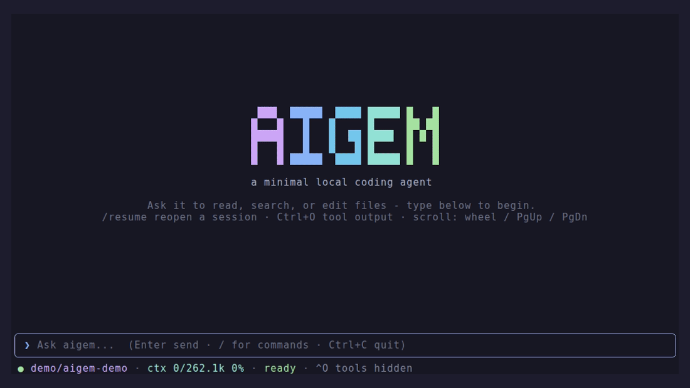

<div align="center">

# aigem

**A terminal AI coding agent, in Go.**

Runs a model against a real sandbox - your own llama.cpp server, or a hosted one.

[](https://github.com/gigovich/aigem/actions/workflows/ci.yml)
[](https://pkg.go.dev/github.com/gigovich/aigem)
[](https://goreportcard.com/report/github.com/gigovich/aigem)
[](https://github.com/gigovich/aigem/releases/latest)
[](LICENSE)

[Documentation](https://gigovich.github.io/aigem/) ·
[Getting started](docs/getting-started.md) ·
[Security model](docs/security.md)



</div>

---

aigem is a coding agent that lives in your terminal. It has a
[Bubble Tea](https://github.com/charmbracelet/bubbletea) TUI, a small set of
sandboxed tools, and an unusually explicit answer to the question *"what is this
thing actually allowed to do?"*

It started as a client for a locally-served Gemma model and grew into a general
agent. It still runs happily against a model on your own hardware, which is the
part most agents leave out.

## Install

With Go 1.26 or newer:

```sh
go install github.com/gigovich/aigem/cmd/aigem@latest
```

Or download a binary for Linux, macOS, or Windows (amd64 and arm64) from the
[latest release](https://github.com/gigovich/aigem/releases/latest) - no toolchain
needed.

## Use it

```sh
aigem                        # open the TUI in the current directory
aigem -p 'what does internal/agent do?'    # one-shot, prints to stdout
aigem auth login openai      # or `aigem models init` for a local model
```

## What it does

**Sandboxed tools.** `read_file`, `write_file`, `edit_file`, `list_dir`, `grep`,
`fuzzy_find`, and `bash`. File paths resolve under the working directory, and
traversal is blocked - including through symlinks. A path outside it prompts you
by name, and a write outside it is asked about *every single time*, never
remembered. → [Tools](docs/tools.md)

**A trust model that is actually enforced.** Unattended runs use capability
profiles: the default `workspace-write` does not expose `bash` at all, so `-y`
cannot silently approve a shell command. Hooks, skills, and MCP servers that come
from a *repository* are inert until you approve them, and the approval is
fingerprinted against their configuration - editing an approved hook invalidates
it rather than grandfathering the new one in.
→ [Security model](docs/security.md)

**Your model or theirs.** A local llama.cpp server (you supply the
`llama-server` binary; llama.cpp fetches the weights on first launch while aigem
drives it, shows progress, and manages the daemon), an OpenAI or xAI API key, a
ChatGPT or Grok subscription, or any OpenAI-compatible endpoint you add. Token
cost and remaining quota are tracked from real responses, so you can compare burn
rate across models.
→ [Models and providers](docs/models.md)

**Parallel subagents.** The model delegates self-contained work to `scout`,
`code-writer`, `simplifier`, or `reviewer` - each in its own context with its own
tool set. Batched calls run concurrently, attributed to the agent that made them.
→ [Tools and subagents](docs/tools.md#subagents)

**Claude-compatible skills and hooks.** Existing `SKILL.md` directories and
`settings.json` hook definitions work as-is, including `PreToolUse` rewriting a
tool's input and `Stop` forcing more work.
→ [Skills](docs/skills.md) · [Hooks](docs/hooks.md)

**Context that survives long sessions.** A three-stage cascade evicts stale tool
output, drops duplicate reads, and finally summarizes older turns - with the full
history backed up before every summarization.
→ [Compaction](docs/tui.md#context-compaction)

**Chat bots.** The same agent, unattended, in a Mattermost workspace: one process
per bot, per-bot models and budgets, cron prompts, and handoff between roles.
→ [Chat bots](docs/bots.md)

## Documentation

Full docs are at **[gigovich.github.io/aigem](https://gigovich.github.io/aigem/)**.

| | |
| --- | --- |
| [Getting started](docs/getting-started.md) | Install, first run, every flag |
| [Security model](docs/security.md) | Sandbox, profiles, path grants, project trust |
| [Models and providers](docs/models.md) | Local and hosted models, quota tracking |
| [Tools](docs/tools.md) | Built-in tools and subagents |
| [Skills](docs/skills.md) · [Hooks](docs/hooks.md) · [MCP](docs/mcp.md) | Extending the agent |
| [The TUI](docs/tui.md) | Keys, sessions, compaction, theming |
| [Configuration](docs/configuration.md) | Paths, system prompt, project files |
| [Chat bots](docs/bots.md) · [Docker](docs/docker.md) | Running unattended |
| [Architecture](docs/architecture.md) | Package map, for contributors |

## Caveats worth reading

**`bash` is not sandboxed.** The sandbox constrains the *file* tools. The `bash`
tool runs a real shell, so it can touch anything your user can - the deny lists
catch catastrophic commands, not every bad idea. Only approve `bash` calls you
understand.

**Subscription logins reuse the vendor's own CLI client.** The ChatGPT and Grok
subscription paths authenticate as the vendor's first-party CLI and talk to
undocumented endpoints. They work well, but the risk lands on your subscription
account, and API keys are the supported alternative.
→ [details](docs/models.md#subscription-logins-read-this-first)

**On Windows, `bash` needs a `bash`.** Git Bash or WSL, for the `bash` tool and
for hooks and skills that shell out. The rest works without one.
→ [why there is no PowerShell fallback](docs/tools.md#bash-on-windows)

aigem sends nothing anywhere you did not configure. There is no telemetry, and web
search is off until you set up a backend.

## Contributing

Issues and pull requests are welcome. See
[CONTRIBUTING.md](CONTRIBUTING.md) for the workflow and house style, and
[SECURITY.md](SECURITY.md) to report a vulnerability privately.

## License

[Apache License 2.0](LICENSE). Copyright 2026 Givi Khojanashvili.
